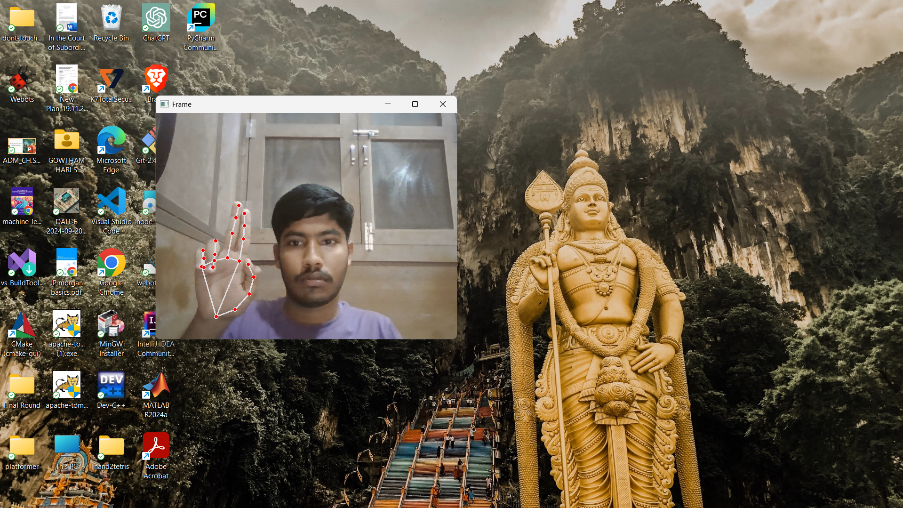

# Hand Gesture Mouse Controller  

A custom mouse controller built using OpenCV, MediaPipe, and Pynput that allows mouse control through hand gestures captured via a webcam.  

## Features  
- **Move Mouse:** Control mouse movement using index finger tracking.  
- **Left Click:** Bend index finger while keeping the middle finger straight.  
- **Right Click:** Bend middle finger while keeping the index finger straight.  
- **Double Click:** Bend both index and middle fingers.  
- **Take Screenshot:** Bend both index and middle fingers with thumb closed.  

## Prerequisites  
Ensure you have Python 3.x installed and install the required libraries using:  

```bash
pip install opencv-python mediapipe pynput pyautogui
```

## How It Works  
- **Hand Detection:** Uses **MediaPipe** to detect hand landmarks in real-time.  
- **Gesture Recognition:** Identifies specific finger positions and gestures.  
- **Mouse Control:** Uses **PyAutoGUI** and **Pynput** to map gestures to mouse actions.  
- **Screenshot Capture:** Saves screenshots as `screenshot<random_number>.png` when a specific gesture is detected.  
- **Utility Functions:** The `util.py` file contains helper functions for calculating angles and distances between hand landmarks.  

## Util File (`util.py`)  
- **Angle Calculation:** Computes angles between hand landmarks to determine gestures.  
- **Distance Calculation:** Measures distances between fingers to distinguish different actions.  
- **Gesture Handling:** Helps in recognizing different gestures based on landmark positions.  
- **Mouse Integration:** Works with **PyAutoGUI** and **Pynput** to execute corresponding mouse actions.  
- **Screenshot Function:** Implements logic to capture and save screenshots using a specific gesture.

---
## Usage
- Ensure your webcam is connected.
- Run the script and position your hand in front of the camera.
- Perform the predefined gestures to control the mouse.
- Press `Q` to exit the program.

## Libraries Used

```python
import cv2            # Captures video and processes frames
import random         # Generates random numbers for screenshot filenames
import mediapipe as mp # Detects hand landmarks
import pyautogui      # Controls the mouse pointer and takes screenshots
from pynput.mouse import Button, Controller  # Handles mouse click events
import numpy as np    # Performs mathematical calculations (angle, distance)
import util           # Custom utility module for gesture recognition
```

## Functions Used

### Gesture Detection & Mouse Control

```python
def find_finger_tip(processed):
    """Finds the tip position of the index finger."""
```

```python
def move_mouse(index_finger_tip):
    """Moves the mouse pointer based on the index finger's position."""
```

```python
def is_left_click(landmarks_list, thumb_index_dist):
    """Detects if the left-click gesture is performed."""
```

```python
def is_right_click(landmarks_list, thumb_index_dist):
    """Detects if the right-click gesture is performed."""
```

```python
def is_double_click(landmarks_list, thumb_index_dist):
    """Detects if the double-click gesture is performed."""
```

```python
def is_screenshot(landmarks_list, thumb_index_dist):
    """Detects if the screenshot gesture is performed."""
```

```python
def detect_gestures(frame, landmarks_list, processed):
    """Analyzes hand landmarks to detect gestures and trigger actions."""
```

### Helper Functions (from `util.py`)

```python
def get_angle(a, b, c):
    """Calculates the angle between three hand landmarks."""
```

```python
def get_distance(landmark_list):
    """Computes the Euclidean distance between two landmark points."""
```

### Video Processing & Execution

```python
def main():
    """Captures video, processes hand landmarks, detects gestures, and displays the frame."""
```

## How to Run

1. Install dependencies:
   ```sh
   pip install opencv-python mediapipe pyautogui pynput numpy
   ```
2. Run the script:
   ```sh
   python script.py
   ```
3. Perform hand gestures to move the mouse, click, or take screenshots.

## Sample Output

Here is an example of the program detecting hand gestures and controlling the mouse:




